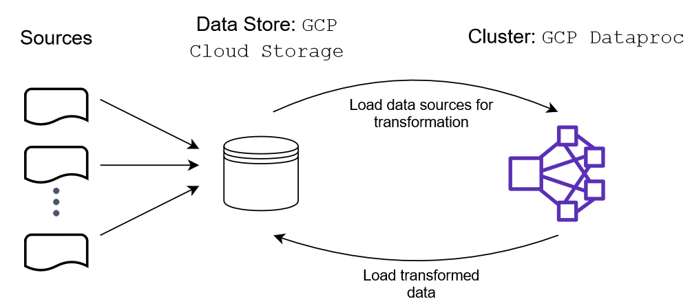

# Transform I94 Immigration Data with PySpark on Google Cloud Platform's Dataproc

## Objective

The US National Tourism and Trade Office gather data from visitors to the US from all over the world. The objective of this project is to combine this data with statistics of temperature of the country of origin and demographics of state where the traveler visited. This enhancement allows to better understand the incoming travellers to the US. A file storage in Google Cloud Storage, to easy access and analysis, is the expected product of this data pipeline.

## Overview

The scope is to improve gather and combine information related to visitors to the US starting off the I94 immigration data. The output is an analytic table that can be used by data analytics from the government, marketing or other businessess. This table contains information related to the country of origin of the visitors as well as information about the location where the visitor arrived in the US.

The principal issue with the I94 immigration data is that the information is stored as code like for example US states, occupation and dates. This makes the data not explicit for all type of users. Also this dataset lacks of context information that we are aim to add. Given the large of amount we take advantage of PySpark running in Google's Dataproc cluster to do the data transformations.

## Implementation

### ETL

We are dealing with large amount of data and we have the need to transform it to allow further analysis. This pipeline is intended to run it annually or semi-annually.  Below is explained this process.

##### Sources
We have four sources of data that are stored in a AWS S3 bucket: 
- I94 Immigration Data: US National Tourism and Trade Office data of visitors. Source: [I-94 Record](https://travel.trade.gov/research/reports/i94/historical/2016.html)
- World Temperature Data: Information of temperature by city. Source: [Kaggle](https://www.kaggle.com/berkeleyearth/climate-change-earth-surface-temperature-data)
- U.S. City Demographic Data: Demographic statistics by state of the U.S. Source: [Opensoft](https://public.opendatasoft.com/explore/dataset/us-cities-demographics/export/)
- Airport Code Table: Airport codes and corresponding cities. Source: [DataHub](https://datahub.io/core/airport-codes#data)

##### Extraction

The sources are loaded to a S3 bucket in order that the EMR cluster can access the data with PySpark

##### Transformation

Once the data is loaded in a PySpark dataframe the following transformation are performed

1. **Date columns cast type**: The columns with the arrival and departure date, from immigration data, were transformed from SAS date numeric field to datetime

2. **Add demographic data**: Using the column `i94addr` from the immigration data we join the demographic data. This information is avaible at the city level but the immigration data only have information of the visitors at state level. Thus, this information was aggregated to state level in order to combined it with immigration data.

3. **Add airport data**: As a preliminary step to join the temperature data we map the city of origin from airport code

4. **Add temperature data**: With the city origin we can get the temperature by airport and arrival date

##### Load

The resulting dataframe was loaded into a S3 bucket in order to long-term storage.

A diagram of the process is below:

### Files

- `transform.py`: Python script to submit to Spark

- `submit_onejob.sh`: Bash script to run the job on Dataproc`

- `data_dictionary.xlsx`: Excel file with meta data of the transformed data table

## Instructions

1. Download data from https://drive.google.com/drive/folders/1bM4lJhssSqo8DGhv3cVBBbkWYhIvv-JO?usp=sharing 

2. On Google's cloud shell do the following:

    1. Create a stoage bucket with project id as a name:

        `export PROJECT_ID=$(gcloud info --format='value(config.project)')`

        `gsutil mb gs://$PROJECT_ID`

    2. Create Dataproc cluster

        `gcloud dataproc clusters create sparktodp --region us-central1 --image-version=2.0 --properties spark:spark.jars.packages=saurfang:spark-sas7bdat:3.0.0-s_2.12`

3.  On your local computer, upload files to storage bucket from the directory where are the downloaded files; upload files to storage bucket

    `gsutil cp transform.py gs://$PROJECT_ID/transform.py`

    `gsutil cp submit_onejob.sh gs://$PROJECT_ID/submit_onejob.sh`

    `gsutil cp airport-codes_csv.csv gs://$PROJECT_ID/airport-codes_csv.csv`

    `gsutil cp GlobalLandTemperaturesByCity.csv gs://$PROJECT_ID/GlobalLandTemperaturesByCity.csv`

    `gsutil cp us-cities-demographics.csv gs://$PROJECT_ID/us-cities-demographics.csv`

    `gsutil cp -r 18-83510-I94-Data-2016 gs://$PROJECT_ID/18-83510-I94-Data-2016`

4.  On Google's cloud shell do the following:
    
    1. Copy scripts to default Cloud Storage bucket used by Cloud Dataproc:
    
        `gsutil cp gs://$PROJECT_ID/transform.py transform.py`

        `gsutil cp gs://$PROJECT_ID/submit_onejob.sh submit_onejob.sh`

    2. Make the bash script executable:

        `chmod +x submit_onejob.sh`

    3. Launch job

        `./submit_onejob.sh $PROJECT_ID`

## References

- [Solving 5 Mysterious Spark Errors](https://medium.com/@yhoso/resolving-weird-spark-errors-f34324943e1c#ca65#3604)
